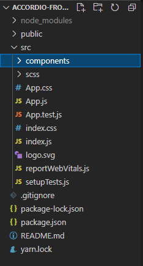
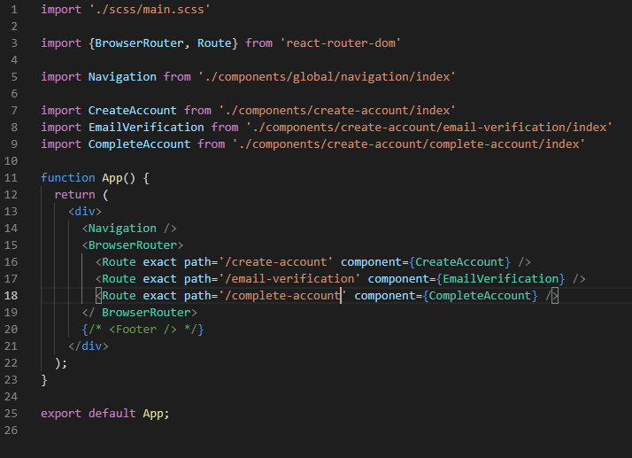
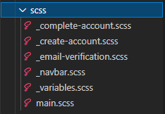
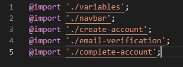
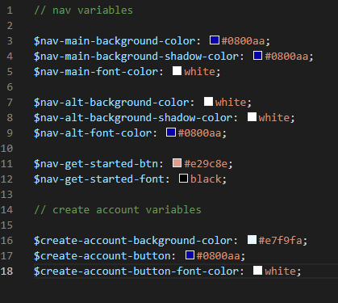
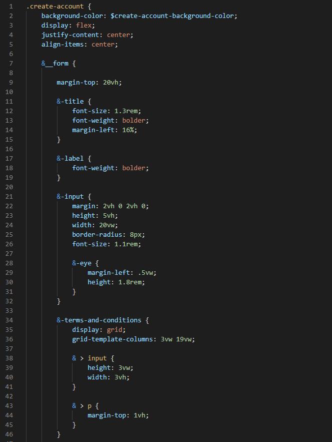
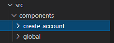
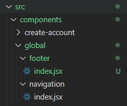
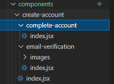

# Guide to code and file structure for Accordio

### Useful links
- Frontend Repo
- Backend Repo
- Planner Repo: 

## Basic File Structure

Below is the image to the basic layout of our project. It is extremely similar to what you get when you first create a react app from scratch.

- package.json: Where dependencies go. If you prefer adding dependencies through the CLI, for example `npm bootstrap` always make sure to immediately commit and push the changes to github with the correct message. Make sure not to remove dependencies already in place or create redundancies. For example, if `reactstrap` is already in use, don't add `bootstrap`. Furthermore, don't use another styling library, use the one in place. UNLESS, the styling library has a structure not found in `reactstrap` that is necessary to the project.

- src Folder: where most of our actual code goes (components, scss, App.js)

## App.js - Routing, Routers, and how to organize

First, the file has the proper BrowserRouter and Route imports. Also, notice that the scss main file is imported at this location. This means that it "trickles" down to all of the components used in this file. Since all the components we code are routing from here, all the components we use will have access to our scss by default. (For example, the following components already have access to our scss: Navigation, CreateAccount, EmailVerification, and CompleteAccount)

When importing, group them together by logic. For example, lines 7 thru 9 are all components directly related to each other because they are all part of the registration flow. Separate these imports by a blank line (line 6, line 10). This has no technical impact to the code, but makes it extremely easier to read, organize, and update in the future.

Notice that all of our components are wrapped within `<BrowserRouter>` except for two. `<Navigation>` and `<Footer>` are placed on the top and bottom so that they always persist no matter which component you are rendering. It is easier to place them only once in this manner, than having to import it and place it every single component you create and use. (**Notice that Footer is currently commented since it has not been created yet)

## SCSS - File structure, components, and management

Our basic file structure is pretty straightforward. `main.scss` is similar to `App.js` file but for scss rather than jsx. `main.scss` is where all of our scss code and components get routed through, which it is the only file that needed to be imported in our `App.js` file. All other files need to have the "`_`" prefix.

Below is our `main.scss` file. Again, it is straightforward and similar to our `App.scss` file. All of our other scss files get imported here with this convention: `@import './[FILE_NAME]';`. Notice that when they are imported here, you do not need to include the "`_`" prefix, the scss language processes that automatically. (However, when creating the file in the file system, you still have to prefix it with the underscore: "_")

The next important scss file is the `variables` file because it holds all of constants in our scss code. If you need to be verbose in naming them, do so, it is better than leaving room for interpretation. Please follow the structure in the image below. 

Notice that our variables are seperated by comments and spaces to indicate that a group of variables belong to the components mentioned in that comment. In the `create account variables` these variables are used for all of the components in the registration flow, not just the component literally named `createAccount`.

**This section of documentation is still under construction to describe and show the structure of a general scss file such as the one shown below. Please refer to other already completed scss file components for guidance. Also, ask me (Alejandro) for guidance and any questions you have. 

## Components - File structures for different types of components

The basic file structure for the first layer of components is shown below. Every project will have a global folder which contains nav and footer components. Then each component flow will have their own folder. In this case, the only other flow is to create an account, called create-account.

The global structure has two folders within it, navigation and footer, each of which has an index.jsx file inside that corresponds to that component. Notice that regardless of what that component is, the file is called index, this will be our standard naming convention. The way we tell our components apart is by folder name, index.jsx is simply the root of our code. (**Notice, jsx is equivalent to js except that in VSCode there are preset functions that show up automatically in jsx that doesn't show up when coding in a js file. Functionally they are equivalent, but jsx is easier to code react (jsx) code in VSCode)

Following our naming convention, all of our root jsx files are names `index`. Since, if there are images used for a certain component, create an images folder within that specific component folder ONLY. This creates order and structure which means it makes it incredibly easier to update and change in the future than having one encompassing `images` folder inside of our src folder rather than the component folder. If want to create a `functions.jsx` file for certain functions that take a lot of code to write or that you think makes the code easier to write, do so, but again, similar to images, create that file ONLY for that component and place it within that component folder ONLY. (For example, if I wanted to create a `functions.jsx` file for email verification, all of the immediate children of the email-verification would be: `images`, `index.jsx`, and `functions.jsx`)

